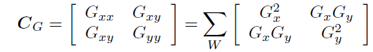
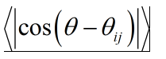

September 2019 – upadated February 2020 – updated August 2021
# Nematic Analysis – Manual
This analysis takes microscopy images of actin fibers and analyses their organization. This includes:
1. Preprocesseing – generating projection images and masks
2. Raw analysis- calculate orientation, coherence, reliability, local order parameter
3. Plotting the data for presentation

Following this, defect identification and tracking can be performed as a separate step.

## 1. Pre-Processing: Create singe plane projections and masks

The orientation analysis runs on single plane images of actin fibres. These can be maximum intensity projections of fluorescence image stacks, or projection images built based on signal from surface of actin fibres, extracted using the layer separation process. The single plane images should be saved as separate timepoints (see end of layer separation manual for imageJ macro to help with this).

### Creating masks:

To perform analysis only on desired region of images, we create binary masks for each image. The default is to exclude the area outside the tissue (where there is no fluorescent signal), and the outer edge of the tissue, where there are strong fluorescence gradients that cause artefacts in orientation analysis. However, if you are interested only in a specific region of the tissue, you can manually create a mask accordingly.

As a default, masks can be automatically created in two steps using the ImageJ macro “make_raw_mask” / “make_raw_mask_lightsheet”, and further processing (which is often performed in advance before, such as in preparation for layer separation, but can also be done within the orienation analysis pipeline. In these cases, the raw masks need to be saved under the display directory (“movie name/Display”), under the “RawMasks” folder ( and “Masks” for refined masks if they already exist). In the main function, if you choose to use the automatically generated masks, the program will check if the refined masks exist by searching for a folder named (“movie name/Display/Masks”). If it exists, these masks will be copied over to the orientation analysis folder (so we keep track of what masks were used). If only a “Raw masks” folder exists, the program will run the functions to create the final refined masks, and save them under the “Masks” folder. **Please see mask creation manual for more details on creating the raw and refined masks.** 

In the main analysis function, set “manual_mask” parameter to indicate if you are using a manual mask or an automatically generated mask: 

```matlab
manual_mask = 0; % 0 if using automatically generated raw masks.
manual_mask = 1; % Set to 1 if using manual masks, which need to be saved in the Orientation_Analysis folder, under "Masks". 
```


## Steps 2-3: Overview, folder structure and functions 
### Main function: “mainAnalysisFunction”
**mainDir** – is the main folder containing all the analysis for this movie.

**displayDir** – is the main folder containing the masks for this movie.

These subfolders need to be saved under the main folder, with images inside:

**mainDir\Raw Images**  contains the original (projection) images

**displayDir\RawMasks** contains the raw masks (1 inside, 0 outside)

**or** (if using manually generated masks): **mainDir\Masks** contains the masks (1 inside, 0 outside)

These subfolders are generated:

**mainDir\Masks** (if didn't already exist) contains the masks (1 inside, 0 outside)

**mainDir\ AdjustedImages** contains adjusted projection images (after adaptive histogram filtering)
**mainDir\Orientation**  masked orientation field

**mainDir\Reliability** masked relaibility field

**mainDir\Coherence**  masked coherence field

**mainDir\LocalOP**  masked local order parameter field

**mainDir\QuiverFO**  png images of localOP with quiver, side by side with original image with regions defined as ordered (coherence > cohTH and imclose and imopen with a disk of radius coherenceWinSize)

**mainDir\Quiver**  png images of localOP with quiver, side by side with original image with regions where filtLocalOP is defined  (as above with additional imclose with disk of radius localOPwinSize)

**mainDir\Defects**  figures showing plots of quiver overlaid with defect annotation

The file **mainAnalysisFunction** allows the user to define a list of movie directories to run on:
```matlab
topMainDir='\\phhydra\data-new\phhydra\Analysis\users\Yonit\Nematic Topological Defects\Movie Analysis\'; % main top folder for movie analysis
mainDirList= { ... % enter in the following line all the all the movie dirs to be analyzed
'2019_07_28_FEP_rings_2hr', ...
'2018_10_22_pos11_test2', ...
};
```
The user needs to set the following input parameters (that are relevant for all movies in the list):
```matlab
toSave=1; % If zero, doesn't save images and doesn't overwrite existing images.
numImages = 1; % Number of images for montage - can be 1,2, or 4.
isLS = 0; % FOR LIGHTSHEET MOVIES THAT NEED TUNING OF THE MASKS. Setting to 1 means the "create total masks" function only smooths the raw masks without performing other operations.
manual_mask = 0; % Default: 0 if using automatically generated raw masks. Set to 1 if using manual masks, which need to be saved in the Orientation_Analysis folder, under "Masks". 
par_num = 6; % Set number of parallel processes for parallel computation.  NOTE THAT IF YOU ARE RUNNING MULTIPLE MOVIES, EACH WILL BE RUN IN PARALLEL
```

### Parallel processing: 
In order to improve efficiency, it is possible to run the analysis in parallel over different individual frames. However, since the anaylsis codes here use graphics handles, it is not possible to use the standard matlab parallel processing toolbox functions such as “parfor”. Instead, the code enables automatic launching of multiple separate instances of matlab, and the total number of frames in the movie is automatically split between the number of parallel instances specified (if none is specified, the default is 8). Note that if you use this option and are running multiple movies, each will run in parallel, so take this into account when setting the number of parallel processes. If you do not wish to use parallel processing, choose the appropriate option in the raw analysis section. 

If you want to use parallel computation, add the relevant path to your
matlab search path (see instructions at the end of this document)!


### Sub-functions: 

For each movie (i.e. a given mainDir), the first function to run is:

```initializeMovie (mainDir);```

This function requires the user to input essential movie information and saves it into a file movieDetails.mat:
```matlab
'Sample type [1=fragment, 2=ring, 3=strip 4=open ring]', ...
'Environment [1= gel, 2= solution, 3=methyl cellulose]', ...
'Calibration [in um/pix]', ...
'Start time in minutes (after excision)', ...
'Time interval in minutes (=0 for entering file)' , ...
'Projection type [1=max projection, 2=layer separation]', ...
'Frames to analyze (optional; in matlab format)'};
```

The next function is the raw analysis on each movie:
```matlab
%% run raw analysis to get orientation, reliability and coherence fields,local OP, fraction ordered and plot quiver  
% IF YOU WANT TO USE PARALLEL COMPUTATION, ADD THE RELEVANT PATH TO YOUR
% MATLAB SEARCH (SEE MANUAL IN MAIN ANALYSIS FOLDER)

runMovieAnalysis_par (mainDir, toSave, calibration, numImages, isLS, par_num, manual_mask, frames );% For parallel computation

```

or:
```matlab
runMovieAnalysis (mainDir, toSave, calibration, numImages, isLS, manual_mask, frames);% For normal (not parallel) computation
```
And finally, plotting the images and anaysis data for presentation: 
```matlab
displayMovieOrientation(mainDir, numImages, frames)
```

## 2. Raw Analysis:
```matlab
runMovieAnalysis (mainDir, toSave, calibration, numImages, isLS, manual_mask,  frames);
```
Defines analysis parameters:
```matlab
gradientsigma=0.5*1.28/calibration; % Sigma of the derivative of Gaussian used to compute image gradients. 
% 0.5 seemed much better than 1 (the gradient appears ~1 pixel)
% Length scale of image intensity variation that are relevant for the gradient.
blocksigma=5*1.28/calibration;  % Sigma of the Gaussian weighting used to average the image gradients before defining the raw orientaion and reliability; Also used as grid size for downsampling orientation
% Length scale of averaging of gradeints which gets rid of local gradient variations and generates a smoother orientation map.
orientsmoothsigma=3*1.28/calibration;  %  Sigma of the Gaussian used to smooth the raw orientation field and generate the orientation field
coherenceWinSize=10*1.28/calibration;  %  Window size for the coherence calculation based on the  raw orientation field 
relTH=0.3; % this is the threshold for determining if the gradient is reliable in a particular region. This is defined from the gradient field determiing if the gradient is strong enough
cohTH=0.95; % this is the threshold for the coherence in a region. 
% We might considering reducing this a little. Does not influence the analysis, only the regions we consider ordered and regions used for plotting
localOPwinSize = 32*1.28/calibration ; % this is the window size used to calculate the local order parameter
% Needs to be on the length scale of the defect core at least.
```

This function calls 3 function (first two- on each frame; third on the entire movie)

``` matlab
runFrameAnalysis(thisFile, mainDir, analysisParameters, toSave); 
% this calculates the orientation field, reliability and coherence
plotFrameAnalysis(thisFile, mainDir, analysisParameters, toSave); 
% this calculates the local order parameter and plots the quiver with the local order parameter and original image

runMovieFracOrdered (mainDir, analysisParameters, toSave, frames); % this calculates the fraction ordered
```
______________________________________________________________________

```matlab 
runFrameAnalysis(thisFile, mainDir, analysisParameters, toSave); 
```
This takes the input image and saves the adjusted image as well as the orientation, reliability and coherence fields defined within the masked region based on the image gradients in the adjusted original image

1.	Adjust intensities on original image with adapthisteq
This takes the input image and generates an intensity adjusted image using the adaptive histogram equilibration in matlab with the following parameters. The visibility of fibers is better after this step- so we save these image (in adjustedImages folder) and perform subsequent analysis on these
```matlab
nIm = adapthisteq(thisIm, 'NumTiles', NumTiles, 'Distribution', 'Rayleigh','Alpha',0.4, 'ClipLimit', 0.01); % Alpha and ClipLimit are taken at defualt calues
NumTiles = [round(imSize/blocksigma/4)
```
Alpha and ClipLimit did not show much sensitivity- so we used the default matlab parameters. ‘Rayliegh’ is a peaked intensity distribution which is what we have. Numtiles- we used a size larger than the block sigma, but again was not very sensitive. 

2.	Analysis with ridgeorient (fingerprint analysis)
```matlab
ridgeorient_withCoherence(nIm, gradientsigma,blocksigma,orientsmoothsigma,coherenceWinSize);
```
1.	Calculate image gradient by convolving with the gradient of a Gaussian with sigma **gradientsigma**
2.	Calculate covariance matrix using a smoothing function with a Gaussian with sigma **blocksigma**  
      
3.	Calculate raw orientation from covariance matrix
      

4.	Calculate **reliability**    which is an indication of how directional the images are in each location.
5.	Calculate **coherence** from raw orientation using **coherenceWinSize** . Defined as   with   is the angle for a given pixel and the average is taken over angles within a window of size 2* **coherenceWinSize**  around this pixel.
6.	Smooth raw **orientation** field by convolving with a Gaussian of with sigma **orientsmoothsigma**
7.	The **orientation**, **reliability** and **coherence** fields are *defined within the masked region*. The masked region is defined from the input mask which is smoothed by convovling with a square kernel of size **blocksigma** and defining the new contour by thresholding at 0.5.
______________________________________________________________________

```matlab
plotFrameAnalysis(thisFile, mainDir, analysisParameters, toSave)
```
This takes the input image and orientation, reliability and coherence fields and calculates the local order parameter and plots the quiver field.

1.	Downsample orientation field, reliability and coherence by averaging over blocks of size **blocksigma**
2.	Calculate local order parameter by averaging over a window of size **localOPwinSize** 
 
3. 	Define region where to plot the local order parameter by taking the region where **coherence>cohTH** and applying the following image filters:
-	Imclose and imopen with a disk of radius **coherenceWinSize**
Smooth the resulting contour by convovling with a square kernel of size **coherenceWinSize** and defining the new contour by thresholding at 0.5
-	Imclose with a disk of radius **localOPwinSize**
Smooth the resulting contour by convovling with a square kernel of size **localOPwinSize** and defining the new contour by thresholding at 0.5
Saves a variable **filtLocalOP** that is equal to the local order parameter on this region and is equal to NaN elsewhere.
4.	Plot and save in Quiver folder a side by side png image of
      1. filtLocalOP overlaid with quiver of the orientation field downsampled by `2*blocksigma`
      2. Original image after adjusting intensity with indication of masked region and region where **filtLocalOP** is defined.
5.	Plot and save in QuiverFO folder a side by side png image of 
      1. filtLocalOP overlaid with quiver of the orientation field downsampled by 2*blocksigma (same as in Quiver)
      2. Original image after adjusting intensity with indication of masked region and region which we define as order (for **fracOrdered**).
6.	Save in a mat file in the folder **mainDir\LocalOP**  with localOP (defined over masked region) and filtLocalOP (defined as indicated above)
______________________________________________________________________

```matlab
[fracOrdered,rawFracOrdered,maskArea] = runMovieFracOrdered (mainDir, toSave, toPlot, thisCohTH, thisCohDiskSize, frames);
````
 This calculates the area fraction of the ordered regions in the movie in mainDir. It allow the user to define a coherence threshold and the length scale over which to apply a filter to the coherence >cohTH region (to close holes and get rid of spots). If cohTH and cohDiskSize are not defined, default values are taken from the analysisParameters.

1.	Takes the coherence field and calculate 
**rawFracOrdered** = area of region with (coherence>cohTH) / masked area
2.	Define coherent region by taking the region where **coherence>cohTH** and applying the following image filters:
Imclose and imopen with a disk of radius **thisCohDiskSize**  (defaul value taken to be **coherenceWinSize**). Smooth the resulting contour by convovling with a square kernel of size **thisCohDiskSize** and defining the new contour by thresholding at 0.5.

**fracOrdered** = area of region with (coherence>cohTH) after applying filters / masked area (This measure seems better- since the coherence is any way defined over **coherenceWinSize**-  so it makes sense to simplify the regions with these filters)

______________________________________________________________________

## Manual defect analysis:
The manual defect analysis is performed separately, through the main fucntion **“mainManualDefectAnalysis.m”**. Here we use the builtin matlab app **Ground Truth Labeler** to identify and track defects.
The input list of movies for analysis and movie initialization is identical to the main orientation analysis.
Following movie intialization, the next step is preparing the movie format for manual defect identification using the Ground Truth Labeller App:
```matlab
%% Prepare images for manual analysis - combine quiver+OP with adjusted images
runMovieGTLformat (mainDir, toSave, calibration, numImages, frames);
```

Next, the manual defect identification can be used  for each movie independently by setting the appropriate index “i”. 
```matlab
%% run manual analysis 
% this will open the groundTruthLabeler after uploading the label
% definitions from the mat file and the movie as an image sequence from
i=1; % place i to choose movie for manual analysis
dirQuiver = [mainDirList{i},'\Quiver']; % figures showing plots of quiver 
cd(codeDir); cd('manualDefectAnalysis');
groundTruthLabeler2('groundTruthLabelingSession_NEW.mat',dirQuiver);
```
Use the app to define defects of type:
“o” -  one
“h” – half
“mh” – minus half
For FEP experiments and detailed defect statistics, use: 
```matlab
groundTruthLabeler2('groundTruthLabelingSessionDefintions_FEP.mat',dirQuiver);
```
Here you can further classify defects according to their pairing, clarity, how spread out they are, etc, and mark frames for further analysis. 
For each defect draw a rectangle on the localOP+quiver image on the left (you can also label the defect on the image on the right- and will be read properly). The code will automatically find the defect as the minimum of the localOP within that rectangular region.
You should also indicate the defect ID in the attributes (this give each defect a unique ID, allowing us to track defects through time over the movie) 
For defects of type half or minus half you can also enter a direction for the defect by drawing a line from the side to the core 
You can try automating the defect identification by choosing algorithm – point tracker, and then pressing automate and run. If the defect is clear this will allow you to track the defect for several frames (click accept)
After going through the movie save the manual tracking results in two ways:
1.	As a session (then you can open it and see everything you did and continue annotating). To prevent overriding previous manual annotation sessions- save with unique date and time
2.	using the Export Labels icon on the right saving the file as resultsGroundTruth.mat

```matlab
plotDefectMovie (mainDir, dirImagesToPlotOn, fileType, dirOutput, frames);
```
This function takes the results of the manual analysis of the movie mainDir, taking images from dirImagesToPlotOn and generates these figures with the defect annotation in dirOutput. The exact defect positions are determined by finding the minima of the localOP in the rectangle regions defined manually.

For each frame the function calls the function plotDefect which:
1.	locates the exact position of the defect as minimum of the localOP in the rectangle
2.	determines the orientation of the defect (for now we’re not doing anything with this yet; will be used in the future for annotating movies)
3.	overlays the defect position on the desired images (from dirImagesToPlotOn) in a color dependent on the defect type
``` matlab
dirQuiver = [mainDirList{i},'\Quiver']; % figures showing plots of quiver 
dirImagesToPlotOn = dirQuiver; fileType='png'; % this is the directory of images we want to overlay the defect annotation on, and the filetype of these images
dirOutput = [mainDirList{i},'\Defects'];
% dirImagesToPlotOn = dirImages;
% frames = 10:30; % for testing on a limitted number of frames
% plotDefectMovie (mainDir, dirImagesToPlotOn, 'png',dirOutput, frames); % loads data from manual defect tracking from mainDir\resultsGroundTruth.mat and images from dirImagesToPlotOn and makes images with overliad defects into dirOutput 
plotDefectMovie (mainDirList{i}, dirImagesToPlotOn, 'png', dirOutput); % loads data from manual defect tracking from mainDir\resultsGroundTruth.mat and images from dirImagesToPlotOn and makes images with overliad defects into dirOutput 
```
This runs the function:
```matlab

[thisImWithDefect, defPosition, defAngle] = plotDefect (thisIm, localOP, thisDefect, typeDefect, duplicateImages);
% [thisImWithDefect, defPosition, defAngle] = plotDefect (thisIm, localOP, thisDefect, typeDefect, duplicateImages);
% This function gets an image, the localOP, and the defect structure for this
% defect (which is of the format generated by ground truth app) of type
% typeDefect. The output is the exact position of the defect (determined as
% the position of the minima of the localOP in the rectangle defined by
% thisDefect), orientation of the defect in degrees based on the line
% direction in thisDefect, and an thisIm overlayed with an annotation of
% this defect added.

```
## Add path permanently to matlab search path (for parallel processing)

In order to run functions from a prompt command inside Matalb, the functions need to be either in the current directory, or in a directory that is part of the Matlab default search path. The functions we currently use require adding the code path to the default search list. Please follow these steps (from Matlab documentation, with comments in blue):

####Set the MATLABPATH Environment Variable
You can also add folders to the search path at startup by setting the MATLABPATH environment variable:

**Windows**

To set the MATLABPATH environment variable in Windows®, from the Windows **Control Panel**, go to **System** and select **Advanced system settings**. If you can’t find this option, use the search option to search within System Click the **Environment Variables**... button:

Click **New**... or **Edit**... to create or edit the MATLABPATH environment variable. In the dialog box that appears, set the variable name to MATLABPATH and the variable value to a semicolon-separated list of folders you want to add to the search path. For example, to add two folders, `c:\matlab_files\myfolder1 and c:\matlab_files\myfolder2`, to the MATLABPATH environment variable, enter `c:\matlab_files\myfolder1;c:\matlab_files\myfolder2` as the variable value. 
Click **OK** to set the variable and exit the dialog box. ***Restart MATLAB for the new settings to take effect.***


To set the environment variable from a command window, run the command `set MATLABPATH=folders`, where folders is a semicolon-separated list of folders. For example, suppose that you want to add two folders, `c:\matlab_files\myfolder1` and `c:\matlab_files\myfolder2`, to the MATLABPATH environment variable. Run the command
`set MATLABPATH=c:\matlab_files\myfolder1;c:\matlab_files\myfolder2`.

**Once the environment variable is set, you must start MATLAB from the same command window for the settings to take effect.** The environment variable persists only as long as the command window is open.

